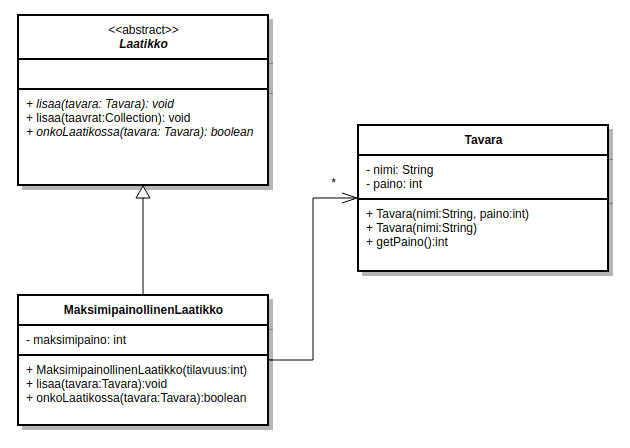
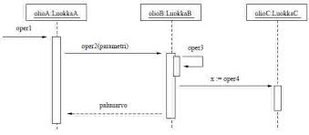
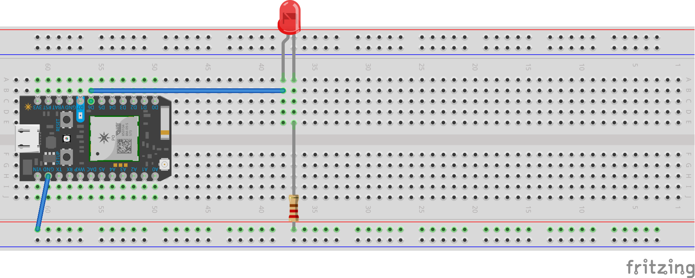
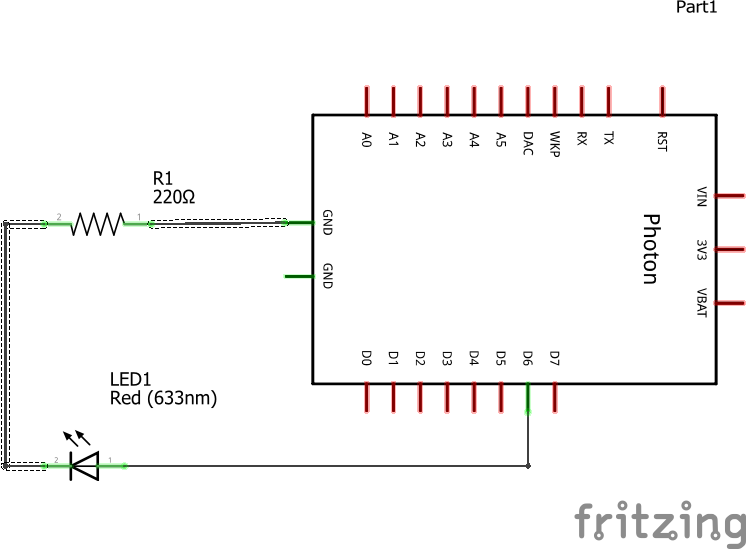

# Sääasema 2020
## Vaatimusmäärittely

**Sovelluksen tarkoitus**
* mitataan ympäristön lämpötila- ja ilmankosteustietoja.
* saatuja tietoja voidaan tarskistella tekstinä ja grafiikkana web sovelluksella.

**käyttäjät**

Web sovellus on tarkoitettu jukiseen käyttöön.

**Käyttöliittymä**

käyttöliittymä koostuu kahdesta näkymästä:

1. Tekstimuotoisen datan selaamiseen tarkoitettu näkymä.
1. Grafiikkamuotoisen datan selaamiseen tarkoitettu näkymä. 

**Jatkokehitysideoita**

Säätietojen selaaminen valitulla aikavälillä.

## Arkkitehtuurikuvaus
**Luokkakaavio**

**sekvenssikaavio**

## Työaikakirjanpito

päivä | aika | tehtävä
------------ | ------------- | -----------
4.11 | 7h | suunnittelua
6.11 | 5h | rakentamista
8.11 | 8h | asentamista/koodausta
## käyttöohje

**järjestelmän konfigurointi**

## Työvaiheet
**Vaihe 2 kytkentä**

